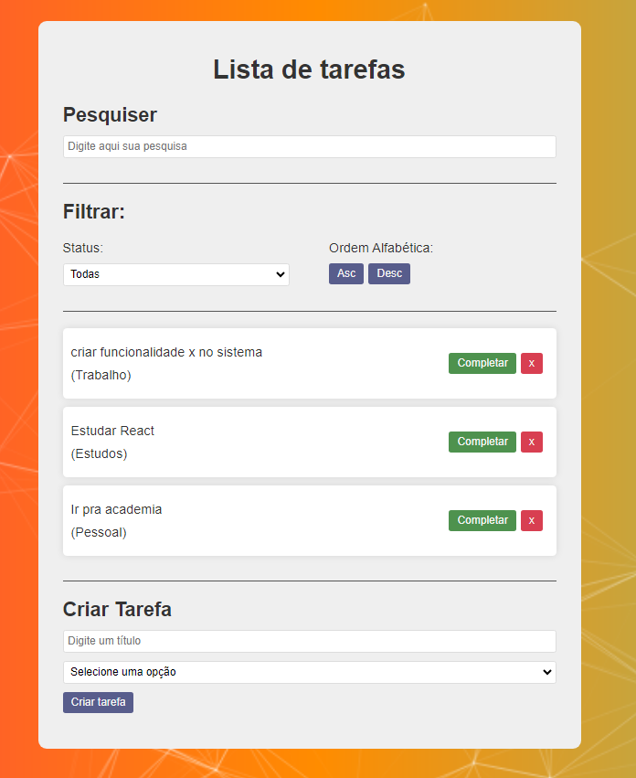

<div align="center" id="top"> 
  

  &#xa0;
</div>

<h1 align="center">todo_react</h1>

<p align="center">
  

  

  

  

</p>

<p align="center">
  <a href="#dart-about">About</a> &#xa0; | &#xa0; 
  <a href="#rocket-technologies">Technologies</a> &#xa0; | &#xa0;
  <a href="#white_check_mark-requirements">Requirements</a> &#xa0; | &#xa0;
  <a href="#checkered_flag-starting">Starting</a> &#xa0; | &#xa0;
  <a href="#memo-license">License</a> &#xa0; | &#xa0;
  <a href="https://github.com/alissoncavalcanticma" target="_blank">Author</a>
</p>

<br>

## :dart: About ##

Projeto usado com base na vídeo aula do Matheus Batisti sobre TO-DO List App com React

## :rocket: Technologies ##

The following tools were used in this project:

- [React.js](https://react.dev/)
- [Vite](https://vitejs.dev/)

## :white_check_mark: Requirements ##

Before starting :checkered_flag:, you need to have [Git](https://git-scm.com) and [React.js](https://react.dev/) installed.

## :checkered_flag: Starting ##

```bash
# Clone this project
$ git clone https://github.com/alissoncavalcanticma/todo_react


# The server will initialize in the <http://localhost:4000>
```
For registry of this project, see the [REGISTRY](registry.md) file.

## View ##

<div align="rigth"> 
  
</div>

## :memo: License ##

This project is under license from MIT License. For more details, see the [LICENSE](LICENSE.md) file.


Made with :heart: by <a href="https://github.com/alissoncavalcanticma" target="_blank">Alisson Cavalcanti</a>

&#xa0;

<a href="#top">Back to top</a>
